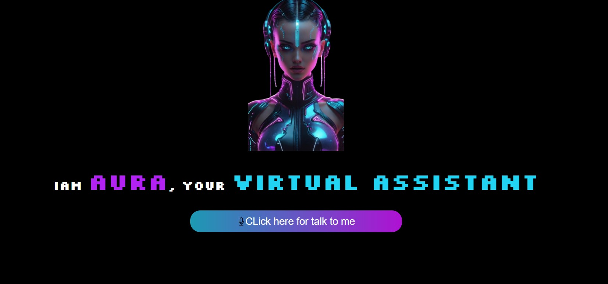

# AURA - Your Virtual Assistant

AURA is a simple virtual assistant built using **HTML**, **CSS**, and **JavaScript**. It leverages browser speech recognition and text-to-speech capabilities to listen to user commands, respond intelligently, and open popular websites or apps.

---

## Demo Screenshot



---

## Features
- **Speech Recognition**: Listens to user commands using the browser's speech recognition API.
- **Text-to-Speech**: Responds audibly to your inputs using the browser's text-to-speech API.
- **Basic Commands**: Perform actions like:
    - Greet with "Hello" or "Namaste".
    - Fetch the current **time** and **date**.
    - Open websites (YouTube, Google, Instagram, etc.).
- **Responsive UI**: Styled for a clean and engaging user experience.

---

## Technologies Used
- **HTML**: Structure of the web application.
- **CSS**: Styling and UI components.
- **JavaScript**: Logic for speech recognition and text-to-speech functionality.

---

## How to Run the Project
Follow these steps to get started:

1. Clone the repository:
   ```bash
   git clone https://github.com/your-username/aura-virtual-assistant.git
   ```

2. Navigate to the project directory:
   ```bash
   cd aura-virtual-assistant
   ```

3. Open the `index.html` file in your browser.

---

## How It Works
1. **Click the microphone button** to start speaking.
2. Say commands like:
    - "Open YouTube"
    - "What's the time?"
    - "Who are you?"
3. AURA will process your speech, respond accordingly, or open websites.

---

## Supported Commands
Here are some examples:

| Command              | Action                    |
|----------------------|---------------------------|
| Hello / Namaste      | Greets the user           |
| Open YouTube         | Opens YouTube in a tab    |
| Open Google          | Opens Google in a tab     |
| Open Facebook        | Opens Facebook in a tab   |
| What's the time?     | Tells the current time    |
| What's the date?     | Tells today's date        |
| Open Instagram       | Opens Instagram           |

---

## Browser Compatibility
- Works best on modern browsers (e.g., Chrome, Edge).
- Requires microphone permissions to function.
- Doest work properly if you are using browsers like :- FireFox, Safari.

---

## Future Enhancements
- Add more intelligent responses.
- Integrate with external APIs for advanced tasks.
- Voice-activated app launching.

---

## Acknowledgment
Developed by **Shreyas Nagaraja**.

---

## License
This project is licensed under the **MIT License**. Feel free to use, share, and improve!
